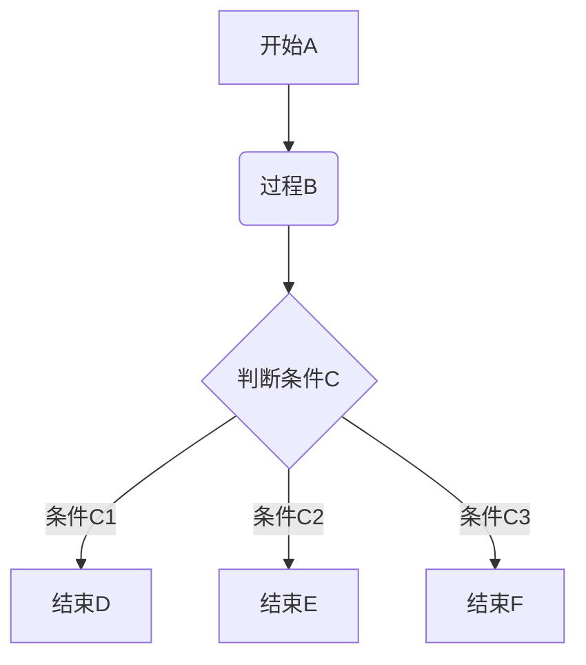
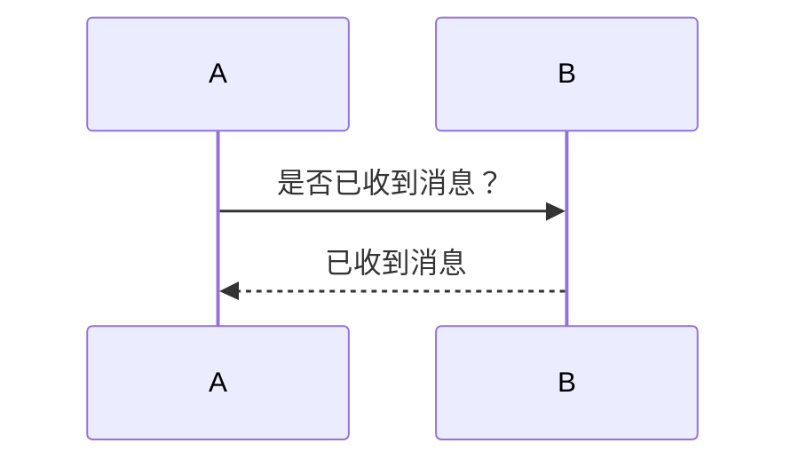
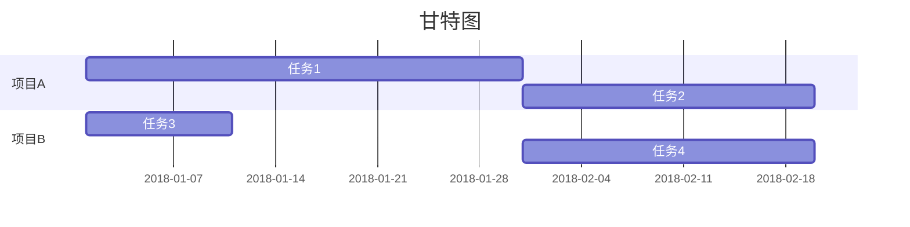

>**<u>参考[菜鸟教程 > Markdown教程](https://www.runoob.com/markdown/md-tutorial.html)部分内容</u>**
>印象笔记中Markdown的**脚注**功能不可用
>[Github源代码](https://github.com/Tsanfer/Markdown_Template)

[TOC]


# 一级标题
## 二级标题
### 三级标题
#### 四级标题
##### 五级标题
###### 六级标题
段落正常字体
*段落斜体*
**段落粗体**
***段落粗斜体***
***
~~删除线~~
<u>下划线</u>

* 无序项
1. 有序项1
2. 有序项2
3. 有序项3
    1. 嵌套项
    * 嵌套项
    
>区块引用
>>一层嵌套引用
>>>二层嵌套引用
>>>
>>>>>>>>>>>十层嵌套引用.....

`printf("这是一个代码片段"); //代码片段`

```C
printf("这是一个代码块");
//代码块
```

|左对齐|居中|右对齐|
|:-|:-:|-:|
|这是一个单元格|这是一个单元格|这是一个单元格|
|这是一个单元格|这是一个单元格|这是一个单元格|

[内联方式超链接](https://www.runoob.com/markdown/md-tutorial.html)

[引用方式超链接][引用式]

[引用式]: https://www.runoob.com/markdown/md-tutorial.html

|图片方式 |图片|
|:-:|:-:|
|图片内联||
|图片引用|![][引用图片]|
|图片内联超链接|[](https://www.runoob.com/markdown/md-tutorial.html)|
|图片引用超链接|[![][引用图片]][引用链接]|

[引用图片]: https://www.runoob.com/wp-content/uploads/2019/03/iconfinder_markdown_298823.png "引用图片属性"

[引用链接]: https://www.runoob.com/markdown/md-tutorial.html


\*\*使用转义字符\*\*

LaTeX_($LaTeX: E=mc^2$)_LaTex
$$LaTeX: E=mc^2$$

```chart
,数值一,数值二,数值三
类型1,5000,8000,4000
类型2,3000,1000,4000
类型3,5000,7000,6000
类型4,7000,2000,3000

type: column
title: 柱状图
x.title: 类型
x.suffix: 单位x
y.title: 数值
y.suffix: 单位y
```

```math
e^{i\pi} + 1 = 0 //(Just English Allow Here)
```








# 快捷键
|功能|键位|
|:-:|:-:|
|新建 Markdown 笔记|Ctrl+Alt+D|
|粗体|Ctrl+B|
|斜体|Ctrl+I|
|删除线|Ctrl+T|
|下划线|Ctrl+U|
|分隔线|Ctrl + Shift + -|
|编号列表|Ctrl + Shift + O|
|项目符号列表|Ctrl + Shift + W|
|插入待办事项|Ctrl + Shift + C|
|代码块|Ctrl+Shift+L|
|插入日期和时间|Alt + Shift + D|
|撤销|Ctrl+Z|
|在笔记内搜索|Ctrl+F|


    >**<u>参考[菜鸟教程 > Markdown教程](https://www.runoob.com/markdown/md-tutorial.html)部分内容</u>**
    >印象笔记中Markdown的**脚注**功能不可用
    >[Github源代码](https://github.com/Tsanfer/Markdown_Template)
    
    [TOC]


    # 一级标题
    ## 二级标题
    ### 三级标题
    #### 四级标题
    ##### 五级标题
    ###### 六级标题
    段落正常字体
    *段落斜体*
    **段落粗体**
    ***段落粗斜体***
    ***
    ~~删除线~~
    <u>下划线</u>
    
    * 无序项
    1. 有序项1
    2. 有序项2
    3. 有序项3
        1. 嵌套项
        * 嵌套项
    
    >区块引用
    >>一层嵌套引用
    >>>二层嵌套引用
    >>>>>>>>>>>十层嵌套引用.....
    
    `printf("这是一个代码片段"); //代码片段`
    
    ```C
    printf("这是一个代码块");
    //代码块
    ```
    
    |左对齐|居中|右对齐|
    |:-|:-:|-:|
    |这是一个单元格|这是一个单元格|这是一个单元格|
    |这是一个单元格|这是一个单元格|这是一个单元格|
    
    [内联方式超链接](https://www.runoob.com/markdown/md-tutorial.html)
    
    [引用方式超链接][引用式]
    
    [引用式]: https://www.runoob.com/markdown/md-tutorial.html
    
    |图片方式 |图片|
    |:-:|:-:|
    |图片内联||
    |图片引用|![][引用图片]|
    |图片内联超链接|[](https://www.runoob.com/markdown/md-tutorial.html)|
    |图片引用超链接|[![][引用图片]][引用链接]|
    
    [引用图片]: https://www.runoob.com/wp-content/uploads/2019/03/iconfinder_markdown_298823.png "引用图片属性"
    
    [引用链接]: https://www.runoob.com/markdown/md-tutorial.html


    \*\*使用转义字符\*\*
    
    LaTeX_($LaTeX: E=mc^2$)_LaTex
    $$LaTeX: E=mc^2$$
    
    ```chart
    ,数值一,数值二,数值三
    类型1,5000,8000,4000
    类型2,3000,1000,4000
    类型3,5000,7000,6000
    类型4,7000,2000,3000
    
    type: column
    title: 柱状图
    x.title: 类型
    x.suffix: 单位x
    y.title: 数值
    y.suffix: 单位y
    ```
    
    ```math
    e^{i\pi} + 1 = 0 //(Just English Allow Here)
    ```
    
    ```mermaid
    graph TD
    A[开始A] --> B(过程B)
    B --> C{判断条件C}
    C -->|条件C1| D[结束D]
    C -->|条件C2| E[结束E]
    C -->|条件C3| F[结束F]
    ```
    
    ```mermaid
    sequenceDiagram
    A->>B: 是否已收到消息？
    B-->>A: 已收到消息
    ```
    
    ```mermaid
    gantt
    title 甘特图
    dateFormat  YYYY-MM-DD
    section 项目A
    任务1: duty1, 2018-01-01, 30d
    任务2: 20d
    section 项目B
    任务3: 2018-01-01, 10d
    任务4: after duty1, 20d
    ```